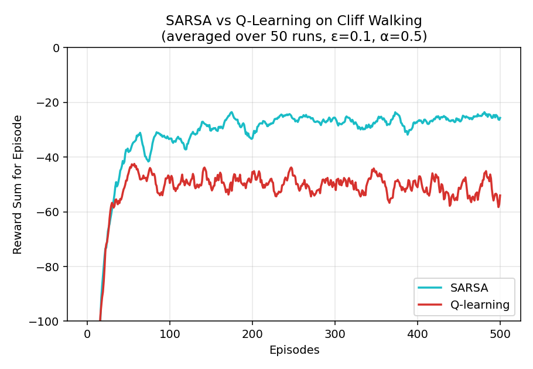
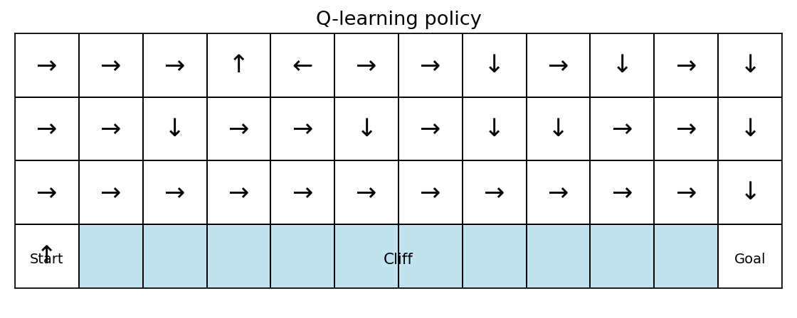
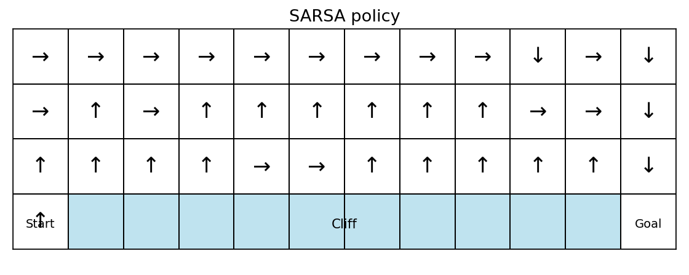
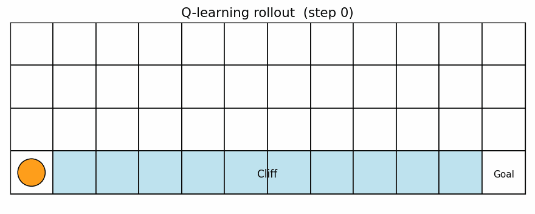
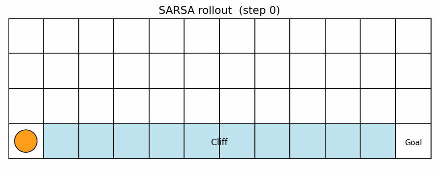

# HW2 — Cliff Walking: Q-learning vs SARSA

DRL Homework 2. Tabular Q-learning (off-policy) and SARSA (on-policy) on the classic
4×12 Cliff Walking gridworld (Sutton & Barto, Example 6.6).

**Live demo:** <https://oomao.github.io/HW2_Cliff_Walking/>

---

## 1. Environment

- Grid: 4 rows × 12 cols, deterministic transitions, clipped to the grid.
- Start: bottom-left `(3, 0)`. Goal: bottom-right `(3, 11)`.
- Cliff: `(3, 1) … (3, 10)` — stepping into any cliff cell returns reward **−100**
  and teleports the agent back to Start without terminating the episode.
- Any other step returns **−1**.
- Actions: `{up, right, down, left}`.

## 2. Algorithms

Both agents share a tabular Q table `Q ∈ ℝ⁴⁸ˣ⁴` and an ε-greedy behaviour policy
with uniform ties broken at random.

| | Q-learning (off-policy) | SARSA (on-policy) |
|---|---|---|
| Update | `Q[s,a] += α (r + γ · max_{a'} Q[s', a'] − Q[s, a])` | `Q[s,a] += α (r + γ · Q[s', a'] − Q[s, a])` |
| `a'` used in target | The best possible next action (bootstrapped) | The action actually sampled ε-greedily next step |

## 3. Parameters

| Parameter | Value |
|---|---|
| α (learning rate) | 0.5 |
| γ (discount) | 1.0 |
| ε (exploration) | 0.1 |
| Episodes per run | 500 |
| Independent seeds | 50 |
| Step cap per episode | 500 |

The requirement spec also lists `α=0.1, γ=0.9` — these are exposed via CLI flags
(`--alpha`, `--gamma`) but the headline figures use the Sutton & Barto settings so
they match the reference plot.

## 4. Results

### 4.1 Reward curves



Mean reward per episode over 50 runs. SARSA converges to a higher (less negative)
return because its on-policy updates factor in the ε-exploration risk.

### 4.2 Learned greedy policies

| Q-learning | SARSA |
|---|---|
|  |  |

Q-learning commits to the row directly above the cliff (shortest path, 13 steps).
SARSA takes a detour along the top (15 steps) that avoids the catastrophic
cliff penalty when exploration occasionally flips an action.

### 4.3 Animated rollouts

| Q-learning | SARSA |
|---|---|
|  |  |

## 5. Analysis

**Convergence speed.** Both agents achieve the bulk of their learning within
the first ~80 episodes. SARSA's moving-average reward sits a little lower during
the first 50 episodes — its target depends on the behaviour action, so updates
are noisier while exploration is dense — but it stabilises higher thereafter.

**Final performance under ε-greedy behaviour.**

| Method | Final mean reward (last 50 eps) |
|---|---|
| SARSA | **≈ −25** |
| Q-learning | ≈ −52 |

Counter-intuitively, Q-learning ends up *worse* during training. It learns the
*optimal* greedy policy (cliff edge), but 10 % of the time ε-greedy forces a
random move — and a random move along the cliff edge has a ~25 % chance of
stepping into the cliff for a −100 penalty. SARSA bakes that exploration risk
into its value estimates and therefore prefers the safe upper path.

**Stability.** Q-learning's per-episode returns show visibly larger variance
because one cliff fall erases many nominal steps. SARSA's returns are tighter.

**Risk vs optimality.** This is the textbook illustration of the on- vs off-policy
distinction:

- **Q-learning** is right if the *deployment* policy will be greedy (ε = 0) and
  you only care about the asymptotically optimal path.
- **SARSA** is right if the actor that produced the data will also act during
  deployment, or if exploration / noise can never be fully switched off.

## 6. Repository layout

```
.
├── src/cliff_walking/   # environment, agents, training, plotting
├── artifacts/           # generated figures, GIFs, and raw .npy traces
├── docs/                # GitHub Pages live demo (served from /docs)
├── scripts/             # startup.sh / ending.sh dev workflow
├── openspec/            # openspec change history
├── requirements.txt
└── README.md
```

## 7. Reproducing the figures

```bash
python -m pip install -r requirements.txt
PYTHONPATH=src python -m cliff_walking.train   # writes artifacts/*.npy
PYTHONPATH=src python -m cliff_walking.plots   # writes artifacts/*.png, *.gif
```

Training 50 seeds × 500 episodes × 2 algorithms runs in well under a minute
on a modern CPU.

## 8. References

- Sutton, R. S. & Barto, A. G. *Reinforcement Learning: An Introduction* (2nd ed.),
  Example 6.6 — "Cliff Walking".
